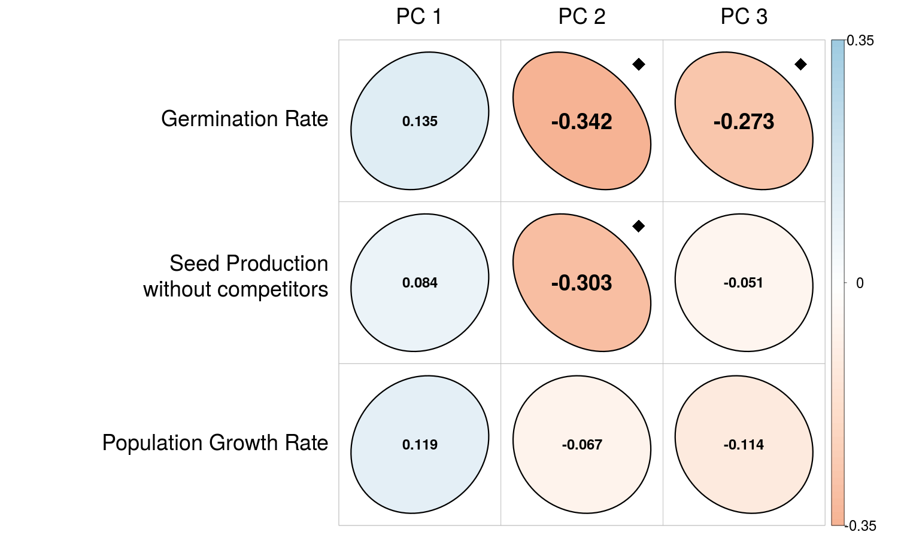

```{r setup, include=FALSE}
knitr::opts_chunk$set(echo = TRUE, cache = T)
htmltools::tagList(rmarkdown::html_dependency_font_awesome())
```

class:inverse
## Functional traits as predictors of species interactions
--


```{r echo = F, out.width="500px", out.height ="500px", fig.align='center'}

```
.footnote.cite[Gaudet & Keddy (1988) Nature]

---
class:inverse

## Trait dispersion patterns across spatial scales

--

.pull-left[]
.pull-right[]

.footnote.cite[Swenson & Enquist (2007) Am J. Botany; Conwell & Ackerly (2009) Ecol. Monographs]

---

class:inverse

## Trait patterns are imperfect proxies for ecological patterns

--


.footnote.cite[Adler et al. 2013 Ecol. Letters]

---
class:inverse

## Parameterizing annual plant demography

$$\Large\frac{N_{t+1,x,j}}{N_{t, x, j}} = (1-g_{x,j})*s_j+g_{x,j}*\frac{\lambda_{x,j}}{1+r_j*\eta_x}$$

.footnote.cite[Chesson (2000) Theor. Pop. Biol, Levine & HilleRisLambers (2007) Nature]

--

| Parameter| Description |
| :--------: | :--------------------------- |
| $\large g_{x,j}$ |  Gerimation rate at site $x$|
| $\large s_j$  | Seedbank survival rate|  
| $\large \lambda_{x,j}$ | Seed production of species at site $x$ in the absense of competitors|
| $\large r_j$ |  Response of species to competitors|  
| | |  
| $\large \eta_x$ |  Size of competitive community at site $x$|  


---

class:inverse


## Spatial storage effects can promote species coexistence


The spatial storage effect can stabilize species coexistence given three conditions:

-  Species-specific environmental responses
-  Covariance between environmental response and competition   
-  Buffered population growth  

.footnote.cite[Chesson (2000) Theor. Pop. Biol]

--


The contribution of storage effects $\Delta I$ follows


$$\Large \Delta I \sim (1-\text{correlation in environmental response})$$


---
class:inverse
## Correlated environmental responses


```{r echo = F, fig.width=10, fig.height=6, fig.align='center', dpi=600}
library(ellipse)
par(bg = NA, mar = c(5,5,5,12), oma = c(0,5,0,5),xpd = T)
plot(1, type = "n", xlim = c(0,1), ylim = c(0, 1), ylab = "", yaxt = "n", xaxt = "n", xlab = "", bty = "n", col.lab = "white", cex.lab = 1.5)
mtext(side = 2,  "Sp. 2\nenv.\nresponse", line = 2, cex = 2, col = "white", las = 1)
mtext(side = 1, "Sp. 1 env. response", line = 3, cex = 2, col = "white")

box(lwd = 3, col = "white")
axis(2, at = c(0,1),  las = 1, col.axis = "white", col.ticks = "white", pos = NA, line = NA, tick = F, hadj = -.3)
axis(1, at = c(0,1),  las = 1, col.axis = "white", col.ticks = "white", pos = NA, line = NA, tick = F, padj = -1.3)
negcorr <- ellipse(-.95, centre = c(0.5, 0.5), scale = c(0.175, 0.175))
nocorr <- ellipse(0., centre = c(0.5, 0.5), scale = c(0.2, .05))
poscorr <- ellipse(.95, centre = c(0.5, 0.5), scale = c(0.175, 0.175))

cols <- RColorBrewer::brewer.pal(3, "Set3")
```


---
class:inverse
## Correlated environmental responses


```{r echo = F, fig.width=10, fig.height=6, fig.align='center', dpi=600}
library(ellipse)
par(bg = NA, mar = c(5,5,5,12), oma = c(0,5,0,5),xpd = T)
plot(1, type = "n", xlim = c(0,1), ylim = c(0, 1), ylab = "", yaxt = "n", xaxt = "n", xlab = "", bty = "n", col.lab = "white", cex.lab = 1.5)
mtext(side = 2,  "Sp. 2\nenv.\nresponse", line = 2, cex = 2, col = "white", las = 1)
mtext(side = 1, "Sp. 1 env. response", line = 3, cex = 2, col = "white")

box(lwd = 3, col = "white")
axis(2, at = c(0,1),  las = 1, col.axis = "white", col.ticks = "white", pos = NA, line = NA, tick = F, hadj = -.3)
axis(1, at = c(0,1),  las = 1, col.axis = "white", col.ticks = "white", pos = NA, line = NA, tick = F, padj = -1.3)

# cols <- RColorBrewer::brewer.pal(4, "Paired")[c(4,3,2)]
cols <- RColorBrewer::brewer.pal(3, "Set3")
polygon(negcorr, border = cols[1], lwd = 4, col = ggplot2::alpha(cols[1], .5))
# polygon(nocorr, border = cols[2], lwd = 4, col = ggplot2::alpha(cols[2], .5))
# polygon(poscorr, border = cols[3], lwd = 4, col = ggplot2::alpha(cols[3], .5))
legend("topright", inset = c(-.55, -.3), pch = 15, col = cols[1], legend="\n\nInversely correlated\nresponse: Storage\neffects possible", bty = "n", text.col = "white", cex = 1.5, x.intersp = .5, pt.cex = 2, xjust = 0)
```

---
class:inverse
## Correlated environmental responses

```{r echo = F, fig.width=10, fig.height=6, fig.align='center', dpi=600}
library(ellipse)
par(bg = NA, mar = c(5,5,5,12), oma = c(0,5,0,5),xpd = T)
plot(1, type = "n", xlim = c(0,1), ylim = c(0, 1), ylab = "", yaxt = "n", xaxt = "n", xlab = "", bty = "n", col.lab = "white", cex.lab = 1.5)
mtext(side = 2,  "Sp. 2\nenv.\nresponse", line = 2, cex = 2, col = "white", las = 1)
mtext(side = 1, "Sp. 1 env. response", line = 3, cex = 2, col = "white")

box(lwd = 3, col = "white")
axis(2, at = c(0,1),  las = 1, col.axis = "white", col.ticks = "white", pos = NA, line = NA, tick = F, hadj = -.3)
axis(1, at = c(0,1),  las = 1, col.axis = "white", col.ticks = "white", pos = NA, line = NA, tick = F, padj = -1.3)

# cols <- RColorBrewer::brewer.pal(4, "Paired")[c(4,3,2)]
cols <- RColorBrewer::brewer.pal(3, "Set3")
polygon(negcorr, border = cols[1], lwd = 4, col = ggplot2::alpha(cols[1], .5))
polygon(nocorr, border = cols[2], lwd = 4, col = ggplot2::alpha(cols[2], .5))
# polygon(poscorr, border = cols[3], lwd = 4, col = ggplot2::alpha(cols[3], .5))
legend("topright", inset = c(-.55, -.3), pch = 15, col = cols[c(1,2)], legend=c("\n\nInversely correlated\nresponse: Storage\neffects possible", "\n\nWeakly correlated\nresponse: Storage\neffects possible"), bty = "n", text.col = "white", cex = 1.5, x.intersp = .5, pt.cex = 2)
```
---
class:inverse
## Correlated environmental responses


```{r echo = F, fig.width=10, fig.height=6, fig.align='center', dpi=600}
library(ellipse)
par(bg = NA, mar = c(5,5,5,12), oma = c(0,5,0,5),xpd = T)
plot(1, type = "n", xlim = c(0,1), ylim = c(0, 1), ylab = "", yaxt = "n", xaxt = "n", xlab = "", bty = "n", col.lab = "white", cex.lab = 1.5)
mtext(side = 2,  "Sp. 2\nenv.\nresponse", line = 2, cex = 2, col = "white", las = 1)
mtext(side = 1, "Sp. 1 env. response", line = 3, cex = 2, col = "white")

box(lwd = 3, col = "white")
axis(2, at = c(0,1),  las = 1, col.axis = "white", col.ticks = "white", pos = NA, line = NA, tick = F, hadj = -.3)
axis(1, at = c(0,1),  las = 1, col.axis = "white", col.ticks = "white", pos = NA, line = NA, tick = F, padj = -1.3)

# cols <- RColorBrewer::brewer.pal(4, "Paired")[c(4,3,2)]
cols <- RColorBrewer::brewer.pal(3, "Set3")
polygon(negcorr, border = cols[1], lwd = 4, col = ggplot2::alpha(cols[1], .5))
polygon(nocorr, border = cols[2], lwd = 4, col = ggplot2::alpha(cols[2], .5))
polygon(poscorr, border = cols[3], lwd = 4, col = ggplot2::alpha(cols[3], .5))
legend("topright", inset = c(-.55, -.3), pch = 15, col = cols, legend=c("\n\nInversely correlated\nresponse: Storage\neffects possible", "\n\nWeakly correlated\nresponse: Storage\neffects possible", "\n\nPerfect correlated\nresponse: Storage\neffects not possible"), bty = "n", text.col = "white", cex = 1.5, x.intersp = .5, pt.cex = 2)
```

---
class:inverse
## Which functional traits drive correlated environmental responses?

--

```{r echo = F, fig.width=9, fig.height=5, fig.align='center', dpi=600}
# library(ellipse)
par(bg = NA, mar = c(5,5,5,5), oma = c(0,8,0,10))
plot(1, type = "n", xlim = c(-1,1), ylim = c(-1, 1), ylab = "", yaxt = "n", xaxt = "n", xlab = "", bty = "n", col.lab = "white", cex.lab = 1.5)
mtext(side = 2,  "Correlation in \nenvironmental\nresponse   ", line = 2, cex = 2, col = "white", las = 1)
mtext(side = 1, "Dissimilarity in functional traits", line = 3, cex = 2, col = "white")

mtext(side = 4, at = c(1), "Perfectly correlated:\nNo storage effect \nstabilization", las = 1, col = "white", cex = 1.4, line = 1)
mtext(side = 4, at = c(-1), "Negatively correlated:\nPotential for strong\nstorage effect stabilization", las = 1, col = "white", cex = 1.4, line = 1)
box(lwd = 3, col = "white")
axis(2, at = c(-1,0,1),  las = 1, col.axis = "white", col.ticks = "white", pos = NA, line = NA, tick = F, hadj = -.3)
abline(h = 0, lty = 2, lwd = 2, col = "white")
# polygon(ellipse(-.9, centre = c(0, 0), scale = c(0.35,0.35)), border = "khaki1",lwd = 4, col = ggplot2::alpha("khaki1", .5))
```

---
class:inverse
## Which functional traits drive correlated environmental responses?

```{r echo = F, fig.width=9, fig.height=5, fig.align='center', dpi=600}
# library(ellipse)
par(bg = NA, mar = c(5,5,5,5), oma = c(0,8,0,10))
plot(1, type = "n", xlim = c(-1,1), ylim = c(-1, 1), ylab = "", yaxt = "n", xaxt = "n", xlab = "", bty = "n", col.lab = "white", cex.lab = 1.5)
mtext(side = 2,  "Correlation in \nenvironmental\nresponse   ", line = 2, cex = 2, col = "white", las = 1)
mtext(side = 1, "Dissimilarity in functional traits", line = 3, cex = 2, col = "white")

mtext(side = 4, at = c(1), "Perfectly correlated:\nNo storage effect \nstabilization", las = 1, col = "white", cex = 1.4, line = 1)
mtext(side = 4, at = c(-1), "Negatively correlated:\nPotential for strong\nstorage effect stabilization", las = 1, col = "white", cex = 1.4, line = 1)
box(lwd = 3, col = "white")
axis(2, at = c(-1,0,1),  las = 1, col.axis = "white", col.ticks = "white", pos = NA, line = NA, tick = F, hadj = -.3)
abline(h = 0, lty = 2, lwd = 2, col = "white")
polygon(ellipse(-.9, centre = c(0, 0), scale = c(0.35,0.35)), border = "tomato2",lwd = 4, col = ggplot2::alpha("tomato2", .5))
```


---
class:inverse

## Questions

- Q1: How correlated are species pairs in their environmental responses?  

- Q2: Do functionally dissimilar species pairs tend to be less correlated in their environmental responses?

---
class:inverse, middle

## Study system: plant species

 
 
---

class:inverse

## Study system: environment


---

class: top, inverse 

## Study system: experimental setup


--

$$\Large\boxed{\frac{N_{t+1,x,j}}{N_{t, x, j}}} = (1-\boxed{g_{x,j}})*s_j+g_{x,j}*\frac{\boxed{\lambda_{x,j}}}{1+\alpha_{x}*\eta_x}$$

---
class:inverse

```{r echo = F, out.width="500px", out.height ="600px", fig.align='center'}
knitr::include_graphics("img/plots.JPG")
```

.footnote.cite[Photo: Nathan Kraft]
---
class:inverse


## Q1 results: Species-specific environmental responses

--


.footnote.cite[Preliminary results]


---
class:inverse
## Q1 results: Species-specific environmental responses


.footnote.cite[Preliminary results]

---
class:inverse
## Q1 results: Species-specific environmental responses


.footnote.cite[Preliminary results]

---
class:inverse

## Q2: Functional correlates of demographic responses

--

.pull-left[- Leaf traits  
  - Leaf size
  - Specific leaf area
  - Leaf dry matter content
  - Leaf drought tolerance (Osmotic potential)
  
- Seed mass  
- Specific root length  

- Whole plant traits
  - Maximum height
  - Canopy shape index (ordinating species from primarily vertical growth to prostrate growth)]

.pull-right[]

.footnote.cite[Image from *Elements of Botany*, Asa Gray]
---

class:inverse

## Q2 results: Functional correlates of demographic responses


.footnote.cite[Preliminary results]

---
class:inverse

## Q2 results: Functional correlates of demographic responses  


.footnote.cite[Preliminary results]

---
class:inverse

## Q2 results: Functional correlates of demographic responses  


.footnote.cite[Preliminary results]

---
class:inverse
## Q2 results: Species vary in their germination response to soil texture and depth
.footnote.cite[Preliminary results]

--

.pull-left[]

.pull-right[]

---
class:inverse

## Summary 

In our system, ...

- Most species pairs tend to have positive but imperfect correlations in environmental response  

- Seed and whole-plant functional traits, but not leaf economics traits, may serve as predictors of correlation in environmental response  


---
class:inverse

## Next steps 


- Predicting demographic correlation from multi-trait models  

- Testing whether plasticity in functional traits influences demographic responses  

--

- Testing whether turnover in soil bacterial and fungal communities explain variation in plant performance and species interactions in our system 

---

class:inverse

## Take-home messages 

- The functional trait approach holds tremendous value for plant ecologists  

- The choice of functional traits should come from an understanding of the of demographic drivers of community dynamics

- Importance of functional traits may depend on scale of the question  


.footnote.cite[Huang et al. (2016) Ecology, Kraft et al. (2015) PNAS]


---


background-image: url(img/sedgwick2.jpg)
background-position: center
background-size: 125%
class: top, inverse 

## Thank you! 

.pull-left[
- Kraft Lab at UCLA:
  - Mary Van Dyke
  - Andy Kleinhesselink

- Levine Lab at ETH Zurich:
  - Oscar Godoy
  - Will Petry   
  - Mirjam von R&uuml;ette
  - Lindsey Rice

- Funding: 
  - NSF DEB Award #1644641  
  - NSF Graduate Research Fellowship Program]

.pull-right[Get in touch!   
<i class='fa fa-envelope'></i> gkandlikar@ucla.edu   
<i class='fa fa-twitter'></i> gauravsk_   
<i class='fa fa-github'></i> gauravsk]

.footnote.cite[rmd source available at https://github.com/gauravsk/esa-2017-talk]
